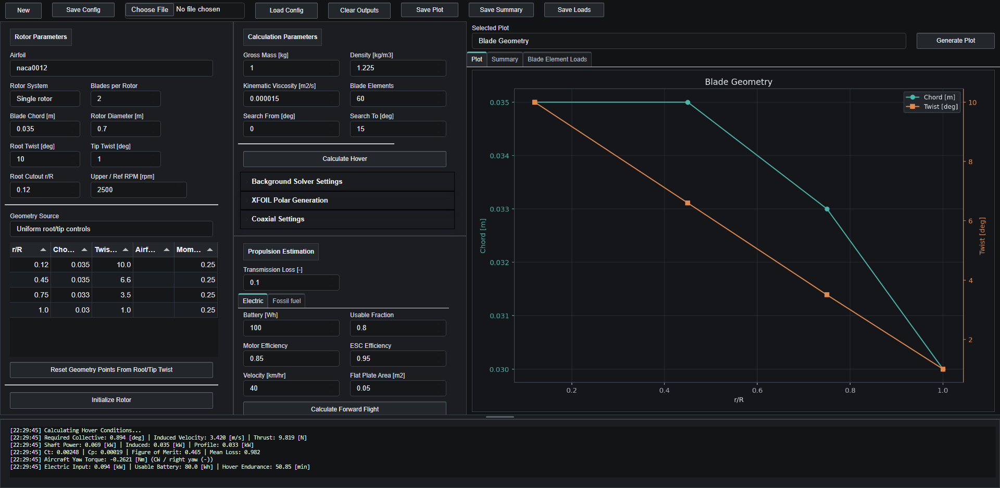
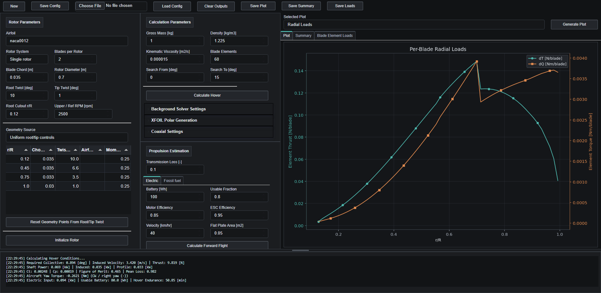
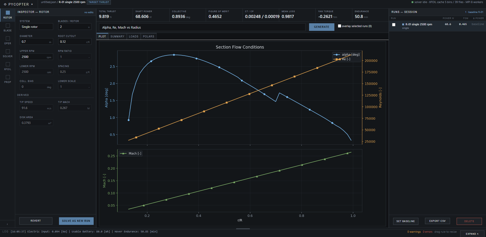
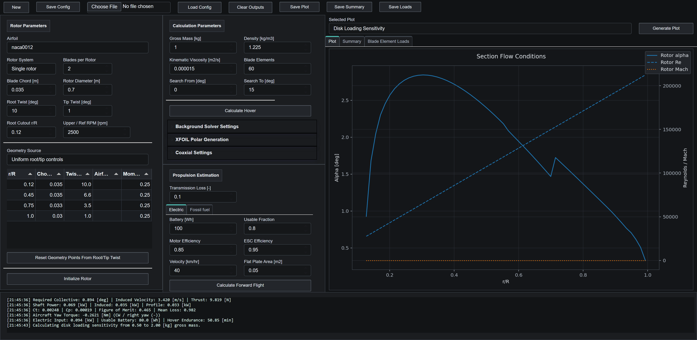
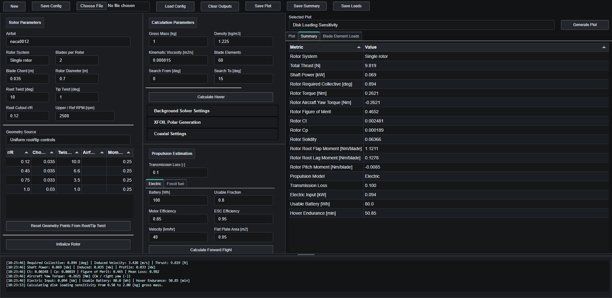
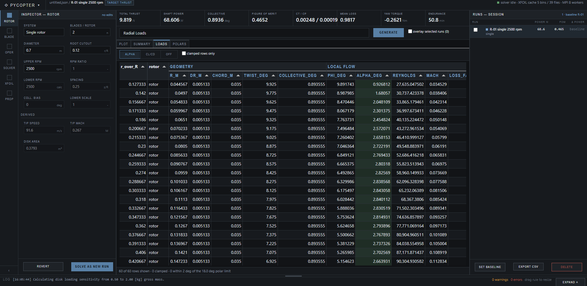

# PyCopter

**A preliminary-design estimator for rotorcraft.** PyCopter sizes a rotor,
trims it in hover with a station-based blade element momentum theory (BEMT)
solver, and reports the shaft power, blade loads, root moments, and
endurance you need to judge whether a configuration is worth pursuing.

Airfoil data is not hardcoded. Section lift, drag, and moment coefficients come
from [XFOIL](https://web.mit.edu/drela/Public/web/xfoil/) runs generated on
demand for the Reynolds and Mach number each blade station actually sees.



---

## Contents

- [What it does](#what-it-does)
- [Quick start](#quick-start)
- [A first calculation](#a-first-calculation)
- [Screenshots](#screenshots)
- [How the model works](#how-the-model-works)
- [Using it as a library](#using-it-as-a-library)
- [Repository layout](#repository-layout)
- [Development](#development)
- [Scope and limitations](#scope-and-limitations)
- [License](#license)

---

## What it does

**Rotor definition.** Single or coaxial rotors. Blade geometry comes either from
uniform root/tip quick-entry fields or from a radial control-point table with
per-station chord, twist, airfoil, and moment-axis position.

**Hover trim.** The solver integrates blade-element lift and drag against
annular momentum balance at every radial station, iterating collective pitch
until the rotor carries the target thrust. Prandtl root and tip losses are
applied per station.

**Coaxial hover.** Upper and lower rotors are solved separately, with a
first-order upper-wake velocity and contraction estimate applied to the lower
rotor. Trim objectives include torque balance (zero net aircraft yaw), equal
thrust, and equal collective.

**Outputs.** Per-element angle of attack, Reynolds number, Mach number, loss
factor, section coefficients, thrust, torque, power, and pitching moment;
per-blade root flap, lag, and pitching moments; thrust and power coefficients,
figure of merit, and signed aircraft yaw torque; electric or fuel-burn endurance
from the shaft power.

**Studies.** Twenty-plus built-in plots, including radial load distributions,
stall margin against the loaded polar range, disk-loading and rotor-diameter
sizing sweeps, headspeed sweeps, collective authority curves, payload/endurance
trades, and coaxial interference versus rotor spacing.

**Exports.** Plot PNG, summary CSV, blade-element load CSV, and JSON
configurations that round-trip back into the UI.

---

## Quick start

### Windows, one click

```bat
start_webui.bat
```

On first run this creates `.venv`, installs the dependencies, and opens the
dashboard in your browser. Later runs just start the server. Press `Ctrl+C` in
the console (or close it) to stop.

### Any platform, manually

```bash
python -m venv .venv
.venv/Scripts/python.exe -m pip install -r requirements.txt   # Linux/macOS: .venv/bin/python
.venv/Scripts/python.exe webui.py
```

The dashboard is served at `http://127.0.0.1:5006/dashboard` (the launcher picks
the next free port if 5006 is taken).

**Requirements:** Python 3.11 or newer.

**XFOIL:** the Windows XFOIL 6.99 executable ships in `data/XFOIL6.99/`, so
nothing extra is needed there. On Linux or macOS, supply your own `xfoil` build.

**MPI:** XFOIL polar generation distributes independent runs across worker
processes and expects an MPI runtime. On Windows install
[Microsoft MPI](https://learn.microsoft.com/en-us/message-passing-interface/microsoft-mpi)
(`msmpisetup.exe`). If you would rather not install it, open **XFOIL Polar
Generation** in the dashboard and set **XFOIL Backend** to *Serial debug* —
slower, but no MPI needed.

---

## A first calculation

The dashboard opens with a small electric drone rotor already filled in.

1. **Initialize Rotor** — validates the geometry and reports tip speed, tip
   Mach, disk area, and solidity.
2. **Calculate Hover** — trims the rotor to the gross mass. The first run
   generates XFOIL polars for the Reynolds/Mach bins the blade needs and caches
   them, so it takes noticeably longer than later runs.
3. Read the results in the **Plot**, **Summary**, and **Blade Element Loads**
   tabs, and the run log along the bottom.
4. Pick any entry from **Selected Plot** and press **Generate Plot**.

A full walkthrough, including what every input means and how to read the
outputs, is in **[docs/TUTORIAL.md](docs/TUTORIAL.md)**.

Three validation cases (Mil Mi-8, MD 500E, UH-60L) ship in
[`tutorials/presets/`](tutorials/presets/) with reference plots.

---

## Screenshots

| Hover result | Radial blade loads |
|---|---|
|  |  |

| Section flow conditions | Disk-loading sizing sweep |
|---|---|
|  |  |

| Summary metrics | Per-element blade loads |
|---|---|
|  |  |

---

## How the model works

The blade is divided into radial elements (60 by default). For each element the
solver:

1. Computes the local inflow angle from the induced velocity and rotational
   speed, giving the local angle of attack from the element's built-in twist
   plus collective.
2. Looks up section `Cl`, `Cd`, and `Cm` at that angle of attack for the
   element's local Reynolds and Mach number. Values come from XFOIL polars,
   generated and cached per condition bin.
3. Applies the Prandtl root and tip loss factor.
4. Balances blade-element thrust against annular momentum theory to update the
   induced velocity, and iterates.

Element thrust, torque, power, and pitching moment are then integrated along the
blade. An outer loop adjusts collective pitch until total thrust matches the
target, and coaxial cases repeat this for the lower rotor inside the upper
rotor's contracted wake.

Because section data is looked up per station rather than assumed from a mean
drag coefficient, results follow the airfoil, and stall shows up as a real
excursion outside the loaded polar range — the dashboard warns when elements
request an angle of attack it had to clamp.

Every GUI input and output is mapped to its Python API endpoint, with units and
ranges, in **[GUI.md](GUI.md)**.

---

## Using it as a library

The calculation layer has no GUI dependencies:

```python
from pycopter import HoverSolver, OperatingPoint, RotorSpec
from pycopter.polars import XfoilPolarProvider

rotor = RotorSpec.from_uniform_blade(
    airfoil="naca0012",
    num_blades=2,
    chord_m=0.035,
    rotor_diameter_m=0.70,
    headspeed_rpm=2500.0,
    washout_deg=-9.0,
    root_cutout_ratio=0.12,
)

result = HoverSolver(XfoilPolarProvider()).solve(
    rotor,
    OperatingPoint(gross_mass_kg=1.0, density_kg_m3=1.225),
)

print(f"collective      {result.collective_pitch_deg:.2f} deg")
print(f"shaft power     {result.power_W:.1f} W")
print(f"figure of merit {result.figure_of_merit:.3f}")

for load in result.element_loads[:5]:
    print(f"r/R={load.r_over_R:.2f}  alpha={load.alpha_deg:5.2f} deg  dT={load.dT_N:.3f} N")
```

Swap in `LinearPolarProvider` for a fast analytic polar when you want to test
solver behaviour without running XFOIL.

---

## Repository layout

```
webui.py                 Web UI launcher
start_webui.bat          One-click Windows launcher (sets up .venv on first run)
src/pycopter/            Calculation core, GUI-independent
    bemt.py              Hover BEMT solver and coaxial hover solver
    models.py            RotorSpec, BladeStation, OperatingPoint, results
    polars.py            Analytic and XFOIL-backed polar providers, caching, MPI
    xfoil.py             XFOIL process driver and airfoil coordinate handling
    utils.py             Interpolation, Reynolds, Wald, reference-area helpers
    pycopter.py          Legacy-compatible Rotor facade
src/gui/                 Panel Web UI (app.py layout/plots, calculations.py wiring)
src/gui_old/             Legacy PyQt5 desktop GUI, kept for reference
scripts/                 Screenshot capture for the docs
tests/                   unittest suite, including headless browser checks
data/XFOIL6.99/          Bundled XFOIL executables; generated polars are ignored
tutorials/presets/       Reference helicopter configurations and result plots
docs/                    Tutorial and images
```

---

## Development

```bash
.venv/Scripts/python.exe -m pip install -r requirements-dev.txt
.venv/Scripts/python.exe -m playwright install chromium
```

Run the suite:

```bash
PYTHONPATH=src .venv/Scripts/python.exe -m unittest discover -v
```

On Windows PowerShell:

```powershell
$env:PYTHONPATH='src'; .venv\Scripts\python.exe -m unittest discover -v
```

The suite covers the BEMT solver, XFOIL polar caching and parallel dispatch,
real-world hover cases checked against published figures, the GUI calculation
layer, and headless browser checks that the dashboard renders and fits common
monitor sizes. Browser tests skip themselves if Playwright is unavailable.

Regenerate the README screenshots after UI changes:

```bash
PYTHONPATH=src .venv/Scripts/python.exe scripts/capture_screenshots.py
```

The legacy PyQt desktop GUI still runs via `python src/main.py` once `PyQt5` is
installed, but the Web UI is the supported interface and gets all new work.

---

## Scope and limitations

PyCopter is a **preliminary design estimator**, not a validation tool. Being
explicit about where it stops:

- Hover is the physics-complete path. Forward flight is a low-order legacy
  estimate: no trim, flapping, retreating-blade stall, or compressibility
  modeling, and it is available for single-rotor cases only.
- Coaxial interference uses a first-order upper-wake velocity and contraction
  estimate. Treat it as a better starting point than total-blade-count
  shortcuts, not as a free-wake analysis.
- XFOIL is a viscous panel method. It is unreliable past stall, so generated
  polars are capped at 18° angle of attack and the dashboard warns when the
  solver had to clamp a request outside the loaded range.
- No structural, dynamic, aeroelastic, or acoustic analysis. Root moments are
  aerodynamic loads for sizing conversations, not certification numbers.

---

## License

Apache License 2.0 — see [LICENSE](LICENSE).

XFOIL is by Mark Drela and Harold Youngren, distributed under the GNU GPL; the
bundled executables in `data/XFOIL6.99/` remain under their original license.
