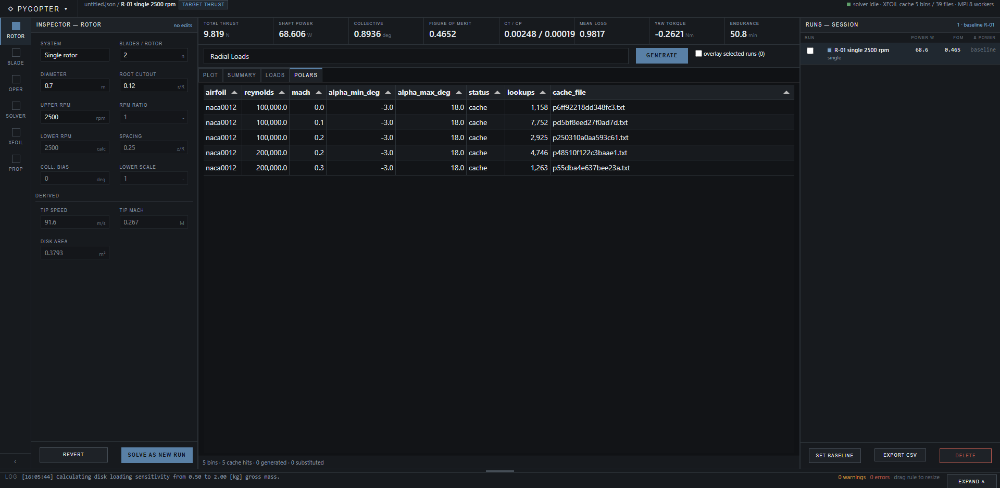

# PyCopter Tutorial

A guided walkthrough of the Web UI: what every input means, how to read the
outputs, and how to run a design study. If you only want to get the dashboard
open, see [Quick start](../README.md#quick-start) in the README.

- [1. The dashboard](#1-the-dashboard)
- [2. Defining a rotor](#2-defining-a-rotor)
- [3. Blade geometry](#3-blade-geometry)
- [4. Hover conditions](#4-hover-conditions)
- [5. Solver and XFOIL settings](#5-solver-and-xfoil-settings)
- [6. Reading the results](#6-reading-the-results)
- [7. Propulsion and endurance](#7-propulsion-and-endurance)
- [8. Coaxial rotors](#8-coaxial-rotors)
- [9. Design studies with the plots](#9-design-studies-with-the-plots)
- [10. Runs, baselines, and comparing designs](#10-runs-baselines-and-comparing-designs)
- [11. Saving, loading, exporting](#11-saving-loading-exporting)
- [12. Worked example: sizing a 1 kg drone rotor](#12-worked-example-sizing-a-1-kg-drone-rotor)
- [13. Validating against real helicopters](#13-validating-against-real-helicopters)
- [Troubleshooting](#troubleshooting)

---

## 1. The dashboard

The window is a fixed-height app shell. Left to right, top to bottom:

- **Command bar** — the **PYCOPTER** brand opens the app menu (new session,
  open/save config, recent configs, the four exports, preferences). Next to it a
  breadcrumb shows `<config file> / <active run>` plus state tags, then the
  coaxial `SHOWING` toggle, then the solver state, XFOIL cache size, and MPI
  worker count.
- **Icon rail** — six subsystems: `ROTOR`, `BLADE`, `OPER`, `SOLVER`, `XFOIL`,
  `PROP`. The `‹` at the bottom collapses the inspector and gives its width to
  the canvas.
- **Inspector** — the settings of the selected subsystem only, so you see the
  six fields you are working on rather than all sixty. A field you change away
  from the loaded configuration is outlined in the accent colour and counted in
  the inspector header, which is how you see what you changed without re-reading
  the whole form. `REVERT` puts everything back.
- **Canvas** — the metric strip, the plot picker and `GENERATE`, then the
  `PLOT`, `SUMMARY`, `LOADS`, and `POLARS` tabs.
- **Run rail** — every calculation of the session, newest first.
- **Log** — a one-line status strip that drags upwards into a filtered
  terminal.

Every region scrolls on its own, so switching tabs, expanding the log, or
collapsing the inspector never moves anything else. The canvas grows to fill
whatever space your monitor has.

**Resizing the run log.** Drag the horizontal rule just above the log to pull
it upwards when you want to read more output; the canvas gives up the space.
Its starting height is the minimum, so it only grows from there, and
double-clicking the rule snaps it back. `EXPAND` does the same in one click.
Expanded, a severity column filters the scrollback to `ALL`, `WARN`, `ERROR`,
or `SOLVER` lines, with a count beside each.

**The metric strip** answers "what did this design just do" without opening a
tab. Eight cells, each with a value, a unit, and a delta against the baseline
run. The delta is coloured by *goodness*, not by sign: more power is red, a
higher figure of merit is green, and a yaw torque moving away from zero is red
whichever way it went.

---

## 2. Defining a rotor

The `ROTOR` tab holds the disk and its speed; the airfoil and blade shape live
on `BLADE`.

| Input | Meaning |
|---|---|
| **System** | *Single rotor* or *Coaxial*. The coaxial fields below it stay greyed out until you pick *Coaxial*. |
| **Blades / rotor** | Blades on **one** rotor, not the aircraft total. For coaxial, the same count applies to each rotor. |
| **Diameter [m]** | Disk diameter. |
| **Root cutout [r/R]** | Fraction of the radius taken up by the hub, where no blade exists. That annulus produces no lift and is excluded. |
| **Upper RPM [rpm]** | Rotor speed. For coaxial, this is the upper (reference) rotor. |
| **RPM ratio** | Lower/upper gear ratio; the resulting **Lower RPM** is shown next to it. |
| **Spacing [z/R]** | Vertical gap between coaxial disks over the upper rotor radius. |
| **Coll. bias [deg]** | Fixed collective offset applied to the lower rotor. |
| **Lower scale** | Scales lower rotor diameter and chord if the two rotors differ. |

Under **Derived**, tip speed, tip Mach, and disk area update as you type, so you
can sanity-check a diameter or an RPM before solving anything. Keep helicopter
tip Mach roughly in the 0.55–0.65 band; small drone rotors typically run much
lower.

> **Blades per rotor changed meaning.** Older PyCopter versions let you fake a
> multi-rotor aircraft by entering the total blade count. That is no longer
> right: use *Coaxial* for stacked rotors so the wake interaction is modeled.

---

## 3. Blade geometry

On the `BLADE` tab, **Airfoil** takes a NACA 4/5/6-digit name (`naca0012`) or a
UIUC database name, which is downloaded on demand. It applies to every station
unless a station overrides it.

**Geometry source** picks how the blade is described:

- **Uniform** — chord, root twist, and tip twist define a linearly twisted,
  constant-chord blade across **Station count** control points.
- **Station table** — the table is the source of truth, so you can taper the
  chord, use non-linear twist, and blend airfoils along the span. Chord and
  station count grey out, because the table now owns them.

Twist is *added to* collective pitch, so a tip twist below the root twist is
normal washout. **Moment axis** is the chord fraction the pitching moment is
taken about, typically `0.25` — a *moment reference*, not blade pitch.

Table columns:

| Column | Meaning |
|---|---|
| **r/R** | Station position, from root cutout to 1.0. Must ascend and be unique. |
| **Chord [m]** | Local chord. |
| **Twist [deg]** | Local built-in twist. |
| **Airfoil** | Leave blank to inherit the global airfoil; fill it to blend sections along the blade. |
| **Axis [c]** | Per-station override of the moment reference axis. |

**Reset from root/tip twist** refills the table from the quick-entry fields — a
convenient starting point before you edit it.

Under **Derived**, solidity, blade area, and aspect ratio follow whichever mode
is active.

The solver interpolates these control points onto its own radial elements
(**Blade elements** on the `SOLVER` tab, default 60), so four well-placed rows
are enough to define a realistic blade.

---

## 4. Hover conditions

The `OPER` tab holds the air and the aircraft.

| Input | Meaning |
|---|---|
| **Gross mass [kg]** | Total aircraft mass to be lifted. The solver trims collective until the rotor produces this weight in thrust. |
| **Flight mode** | *Hover*, or *Forward flight* to also offer the legacy single-rotor forward-flight plots. |
| **Density [kg/m³]** | Air density at the altitude of interest. Sea-level ISA is 1.225. |
| **Kin. viscosity [m²/s]** | Sets the local Reynolds numbers. Sea-level air is about 1.5e-5. |
| **Speed of sound [m/s]** | Sets the local Mach used for polar lookup and the reported tip Mach. |

**Atmosphere helper.** Enter an **Altitude** and a **Temperature** and press
**Apply ISA to density / viscosity**. Those two fields never reach the solver on
their own; the button derives density, kinematic viscosity, and speed of sound
from them and writes them into the three fields above, and the log records what
it wrote. That keeps one source of truth for what the solver actually used.

Under **Derived**, target thrust and disk loading follow the gross mass.

Press **SOLVE AS NEW RUN**.

If the reported collective sits exactly on **Search to**, the solver hit its
bound rather than converging — the rotor could not lift the mass. Check total
thrust against the target before trusting anything else, then raise the bound,
enlarge the rotor, or lower the mass.

---

## 5. Solver and XFOIL settings

**`SOLVER` tab**

- **Trim mode** — *Target thrust* solves collective for the gross mass;
  *Fixed collective* evaluates the **Collective** you enter, which enables that
  field.
- **Blade elements / Spacing law** — radial resolution of the solve. 60 uniform
  elements is a good default. *Cosine* spacing clusters elements at the root
  cutout and the tip, where the loss factor and the loading gradient change
  fastest, without changing the element count or the span.
- **Search from / Search to [deg]** — collective search bounds for the trim.
- **Thrust tol. / Max iter** — how tightly and for how long the trim loop
  chases the target thrust.
- **Tip loss / Root loss** — Prandtl loss models, or none. Prandtl is the
  sensible default; turning them off is a comparison aid.
- **Induced factor** — empirical multiplier (about 1.05–1.15) covering
  non-uniform inflow that momentum theory misses.
- **Coaxial trim** — *Torque balance* solves total thrust with zero net yaw
  torque, the realistic case. *Equal thrust* and *Equal collective* are
  comparison modes.

**`XFOIL` tab**

The MPI worker strip sits at the top of this tab and only here, with the polar
cache size, airfoil count, and queue depth beside it.

- **Mode** — *Cache + gen* generates and caches missing Reynolds/Mach bins.
  *Cache only* never launches XFOIL: a missing bin is an error, not a silent
  approximation. Use it for fast repeat runs on a blade you have already solved.
  The generation settings grey out in that mode, because they would be
  misleading if they still looked live.
- **Workers / Backend** — how many parallel XFOIL processes, and whether to
  distribute them over MPI. Choose *Serial debug* if you have no MPI runtime.
- **Alpha min / max / step [deg]** — range and resolution of the generated
  tables. The maximum is capped at 18°, because XFOIL does not converge
  dependably past stall. A finer step costs XFOIL time and produces a different
  table, so it uses its own cache entry.
- **N crit** — e^n transition amplification factor. 9 is XFOIL's default and
  matches a moderately clean wind tunnel; lower values trip the boundary layer
  earlier. It is part of the cache key.
- **Re bin / Mach bin** — how coarsely flow conditions are grouped before a
  polar is generated. Narrower bins mean more XFOIL runs and finer resolution.
- **XFOIL iter / Timeout** — viscous iteration limit per alpha point, and the
  per-polar process timeout.
- **Cache directory** — optional custom cache path. Generated polars are scratch
  data and are never committed.

If any blade element asks for an angle of attack outside the loaded polar range,
an amber bar appears under the command bar naming the affected rotor and the
requested range, and **SHOW CLAMPED ROWS** jumps to the `LOADS` tab with the
filter already applied. Coefficients are clamped at the edge, so the result is
optimistic in that region — widen the alpha range and regenerate rather than
ignoring it.

---

## 6. Reading the results

### PLOT tab

Whatever you last generated. The figure is drawn at the size of your plot area,
so it stays legible on any monitor.

**Overlay compare.** Tick runs in the rail and switch on
`overlay selected runs (n)`. Every checked run is drawn on the current
per-element plot in the same colours, but wider, translucent, dashed per run,
and underneath the active run — so a compared curve that lands on top of the
active one reads as a halo around it instead of hiding it.

**Reading multi-quantity plots.** Quantities are arranged by their actual
scale. Two that sit within a factor of five share one y-axis. One that is much
larger or smaller takes the right-hand axis — element torque is only about 3%
of element thrust, so on a shared axis it would read as a flat line at zero. A
third quantity on yet another scale moves to its own panel underneath, sharing
the same r/R axis, rather than being crammed onto a third scale.

An axis carrying a single quantity is tinted to match its curve, so you can see
at a glance which scale to read a line against. Colour tells you which quantity
a curve is; line style tells you which rotor (solid upper, dashed lower).

One case worth knowing: Reynolds number and Mach number are both proportional
to local blade speed, so they trace exactly the same shape. Put on opposite
autoscaled axes they would draw the same line and one would silently hide the
other, so PyCopter always separates them into different panels.

### SUMMARY tab

Total thrust and shaft power, then per-rotor trim collective, torque, signed
aircraft yaw torque, figure of merit, `Ct`, `Cp`, solidity, root flap and lag
moments, per-blade pitching moment, and the active propulsion figures.

**Figure of merit** is hover efficiency: the ideal power to lift that thrust
divided by the actual shaft power. Well-designed helicopter rotors reach
0.70–0.80. Small, low-Reynolds drone rotors are often 0.40–0.60 — the numbers in
these screenshots are a 0.7 m drone rotor, so a figure of merit near 0.47 is
expected, not a bug.

**Aircraft yaw torque** is signed: positive is counterclockwise (left) yaw seen
from above, negative is clockwise. A single rotor always produces some, which a
tail rotor must counter; a torque-balanced coaxial pair drives it to zero.

### LOADS tab

One row per radial element, grouped into `GEOMETRY`, `LOCAL FLOW`,
`SECTION COEFFICIENTS`, and `INTEGRATED LOADS`: position, chord, twist, angle of
attack, Reynolds, Mach, section coefficients, loss factor, induced velocity, and
the element's thrust, torque, power, and pitching moment. `r_over_R` is frozen
as the row key while the rest scrolls horizontally, and rows can be selected and
copied but never edited.

The shading selector heatmaps one column: `ALPHA` shades green where there is
margin, amber within 2° of the polar ceiling, and red where the coefficient had
to be clamped; `CL/CD` shades by section efficiency; `OFF` turns it off. Clamped
rows also carry a `CLAMPED` flag, `clamped rows only` filters to them, and the
footer counts how many there are and how many sit within 2° of the limit.

This is where you diagnose a design. Angle of attack climbing toward the polar
limit near the tip means you are running out of stall margin; a collapsing
Reynolds number near the root means that part of the blade is doing little
useful work.

### POLARS tab

The airfoil/Reynolds/Mach bins that actually answered this run, one row each,
with the alpha range of the table, how many times it was looked up, and its cache
file. `status` says where the data came from:

- **cache** — read from an existing cache file.
- **generated** — XFOIL produced it during this session.
- **substituted** — the requested Reynolds or Mach fell outside the provider's
  supported range and was clamped, so the polar describes a *different* flow
  condition than the blade element asked for. Rounding into a Re/Mach bin is the
  normal binning scheme and is not flagged here.

This is where an XFOIL problem becomes explainable instead of just a log line.

---

## 7. Propulsion and endurance

On the `PROP` tab, set **Model** to *Electric* or *Fossil fuel*. Only the active
model's fields are shown and only its outputs appear in the summary and the
plots, so the two never mix.

**Transmission loss** is the mechanical loss between the power source and the
rotor shaft, applied in both models.

**Electric:** Battery [Wh], Usable fraction (reserve — 0.8 is a common limit),
Motor eff., ESC eff. PyCopter reports electric input power and hover endurance
in minutes.

**Fossil fuel:** Fuel capacity [kg] and SFC [kg/kWh]. PyCopter reports engine
input power, fuel flow, and hover endurance in hours.

**Active model outputs** under the fields shows those three numbers for the
selected run without leaving the tab.

The rotor solve produces **shaft power only**. Everything above is applied
downstream, so changing the battery never changes the aerodynamics.

**Legacy forward flight** (Velocity, Flat plate area) is a low-order estimate
for single rotors, kept for range and endurance trends. It has no trim or
flapping model — see [Scope and limitations](../README.md#scope-and-limitations).
Flat plate area is the fuselage's equivalent drag area, either from published
data or as reference area × drag coefficient.

---

## 8. Coaxial rotors

Set **System** to *Coaxial* on the `ROTOR` tab. The spacing, gear ratio,
collective bias, and lower-rotor scale fields there stop being greyed out, and
**Coaxial trim** appears on the `SOLVER` tab.

The lower rotor is solved inside the upper rotor's contracted wake, so it sees
faster inflow and needs more collective for the same thrust. The summary reports
each rotor's thrust share, the interference power delta, and the interference
loss ratio.

**The SHOWING toggle** appears in the command bar for coaxial runs and decides
which result the whole canvas reads from — metric strip, summary, loads, and
plots all follow it together:

| Choice | What you see |
|---|---|
| `UPPER` / `LOWER` | That rotor alone. |
| `TOTAL` | Both rotors, and the pair's totals. |
| `Δ ISOLATED` | Each rotor minus its isolated reference, element by element. This is the coaxial interaction on its own: what the wake cost in thrust, power, collective, and figure of merit. |

Three coaxial-only plots become available: **Coaxial Interference** (isolated
versus coaxial power), **Interference Loss vs Spacing** (sweeps z/R and marks
the minimum), and **Coaxial Thrust Share and Yaw** (yaw authority from
differential collective).

---

## 9. Design studies with the plots

Pick from the plot picker above the tabs and press **GENERATE**. Some plots read
the current result; the sweeps re-run the solver many times and take longer.

**Understanding the current design**

| Plot | Answers |
|---|---|
| Blade Geometry | Is the chord and twist distribution what I intended? |
| Power Breakdown | How much power is induced versus profile drag? |
| Radial Loads | Where along the blade is thrust and torque produced? |
| Alpha, Re, Mach vs Radius | What flow conditions does each station actually see? |
| Induced Velocity and Loss | How much do root and tip losses cost me? |
| Section Coefficients vs Radius | How is the airfoil behaving along the span? |
| Stall Margin vs Radius | How close is any station to the polar limit? |
| Cumulative Thrust and Power | Which part of the blade earns its keep? |
| Geometry Load Contribution | How does geometry map to load share? |
| Pitch Moment vs Radius | What drives the control-linkage hinge moment? |

**Sizing and trade studies** (these re-run the solver)

| Plot | Answers |
|---|---|
| Disk Loading Sensitivity | How do power and collective change with gross mass? |
| Rotor Diameter Sizing | What does a bigger rotor buy in power and endurance, and what does it cost in tip Mach? |
| Reference RPM Sweep | What is the best headspeed before compressibility bites? |
| Collective Authority Curve | How much thrust and yaw authority is left? |
| Payload Endurance Sweep | How does endurance fall off with payload? |
| Energy Capacity vs Endurance | What does a bigger battery or fuel load buy? |
| Efficiency and Loss Sensitivity | How sensitive is input power to efficiency assumptions? |

Sweeps skip points that fail to converge and say so in the log. A sweep that
skips many points usually means the collective search bounds are too tight for
part of the range.

**Interference Loss vs Spacing** runs off the UI thread. Its run appears in the
rail with a progress bar, a point counter, and an ETA, and each solved point
becomes a child run underneath it. **CANCEL** in the inspector footer stops it
after the point in flight and still draws the partial curve, with the run marked
*cancelled*. The point count comes from **Sweep points** in Preferences.

---

## 10. Runs, baselines, and comparing designs

Every calculation is a run in the right-hand rail, newest first: an id, a label,
a meta line, its power and figure of merit, and its power delta against the
baseline.

| State | How it looks |
|---|---|
| queued | dim, no values |
| running | accent dot, progress bar, point counter and ETA |
| done | values and a delta |
| current | accent-tinted row |
| baseline | the delta column reads *baseline* |
| failed | red dot, tinted row, and the exception text inline underneath |

A failed run does **not** clear the previous result: the canvas keeps showing
the run you had, and the failure sits in the rail with its error where you can
read it.

Click a row to make it the active run — the canvas, metric strip, and summary
all switch to it. **SET BASELINE** makes it the reference every other run's
delta is measured against. **DELETE** removes it, and removes a sweep's points
along with its parent. **EXPORT CSV** writes one row per run with every metric
any of them reported.

Tick the checkboxes and switch on `overlay selected runs (n)` to draw the
checked runs on the current per-element plot together.

---

## 11. Saving, loading, exporting

Everything here is behind the **PYCOPTER** menu in the command bar.

- **New session** (`Ctrl N`) resets the inputs and clears the run rail.
- **Open config…** (`Ctrl O`) picks a JSON file, then **Open selected config**
  applies it. The log first prints a field-by-field diff of what the incoming
  configuration changes, so you know what you are about to load. Legacy configs
  from the old desktop GUI are migrated automatically.
- **Save config** (`Ctrl S`) downloads every input and the station table.
  **Save config as…** (`Ctrl ⇧ S`) uses the filename you type above it.
- **Recent configs** re-applies anything you loaded this session.
- **Export plot PNG / summary CSV / loads CSV / session runs** write the current
  figure, the two tables, and the whole session's runs. If you have not
  generated the artifact yet, the log says so instead of downloading an empty
  file.
- **Preferences…** holds the session settings: sweep points, figure render DPI,
  log scrollback, and how many runs a session keeps. They change how much work
  the UI asks for, never the solver equations, and they save and load with the
  rest of the configuration.

---

## 12. Worked example: sizing a 1 kg drone rotor

The defaults are a 0.70 m, two-bladed `naca0012` rotor at 2500 rpm lifting 1 kg
on a 100 Wh battery.

1. **SOLVE AS NEW RUN**. Read the metric strip: collective, shaft power, figure
   of merit, and hover endurance. This is `R-01`, and it starts as the baseline.
2. Generate **Alpha, Re, Mach vs Radius**. Check that no station is near the
   18° polar ceiling and see how low the root Reynolds number is.

   

3. Open `LOADS` with `ALPHA` shading. Amber cells are within 2° of the polar
   ceiling; red ones were clamped, which makes the answer there optimistic.
4. Generate **Rotor Diameter Sizing**. Endurance usually improves with diameter
   until tip Mach or airframe limits stop you — read both panels together.
5. Set the diameter to your best candidate on the `ROTOR` tab. The field
   outlines in accent and the inspector header reads *1 edited*, so you can see
   exactly what differs from the loaded configuration. Solve again as `R-02`.
6. Compare: the metric strip now shows every value as a delta against `R-01`,
   coloured by whether the change is an improvement. Tick both runs and switch
   on `overlay selected runs` to see the radial loads side by side.
7. Generate **Payload Endurance Sweep** to see how much margin you have for a
   camera or a heavier battery.
8. **Save config** so the design can be reloaded or shared, and
   **Export session runs** to keep the comparison.

The habit worth forming: after every geometry change, re-check the radial plots.
A change that improves total power while pushing the tip into stall is not an
improvement.

---

## 13. Validating against real helicopters

[`tutorials/presets/`](../tutorials/presets/) holds three configurations —
Mil Mi-8, MD 500E, and UH-60L (extended fuel) — with reference range plots
produced by the original desktop GUI.

Load one from the app menu and solve. These are full-size helicopters, so expect
much larger diameters, higher tip speeds, and higher figures of merit than the
drone defaults.

`tests/test_hover_real_world_cases.py` checks hover power for a Robinson R22 and
a UH-60 against published figures and runs as part of the suite.

> The preset files were saved by the legacy PyQt GUI, so they carry a `washout`
> field and an embedded output log. PyCopter migrates them on load; the log text
> is ignored.

---

## Troubleshooting

**"MPI XFOIL polar generation was requested, but mpi4py could not load an MPI
runtime."** Install [Microsoft MPI](https://learn.microsoft.com/en-us/message-passing-interface/microsoft-mpi),
or set **Backend** on the `XFOIL` tab to *Serial debug*.

**The first hover calculation is slow.** It is generating XFOIL polars for every
Reynolds/Mach bin the blade needs. They are cached, so later runs on the same
blade are much faster. Set **Mode** to *Cache only* to force cache-only runs.
Changing **Alpha step** or **N crit** changes the generated table, so those bins
are regenerated rather than reused.

**Collective lands exactly on Search to.** The trim did not converge — the rotor
cannot lift the requested mass within the search bounds. Compare total thrust
against the target.

**The amber bar says elements were clamped.** The blade is asking for angles the
polars do not cover. Press **SHOW CLAMPED ROWS** to see exactly which stations,
then widen Alpha min/max, keep **Mode** on *Cache + gen*, and solve again.
Results in that region are clamped and optimistic until you do.

**The POLARS tab reports substituted bins.** A station asked for a Reynolds or
Mach number outside the provider's supported range, so it was answered with a
polar for a different condition. Widen the provider range or check whether the
rotor speed and chord are what you meant.

**An airfoil name is rejected.** NACA names must be `naca` plus 4, 5, or 6
digits. Other names are looked up in the UIUC database and need an internet
connection on first use.

**A sweep reports skipped points.** Those cases did not converge, usually
because the collective search bounds are too narrow across the swept range.
Widen Search from/to and try again.

**A run failed.** Its row in the rail carries the exception text inline. The
previous result is still on the canvas, so you can read both.
