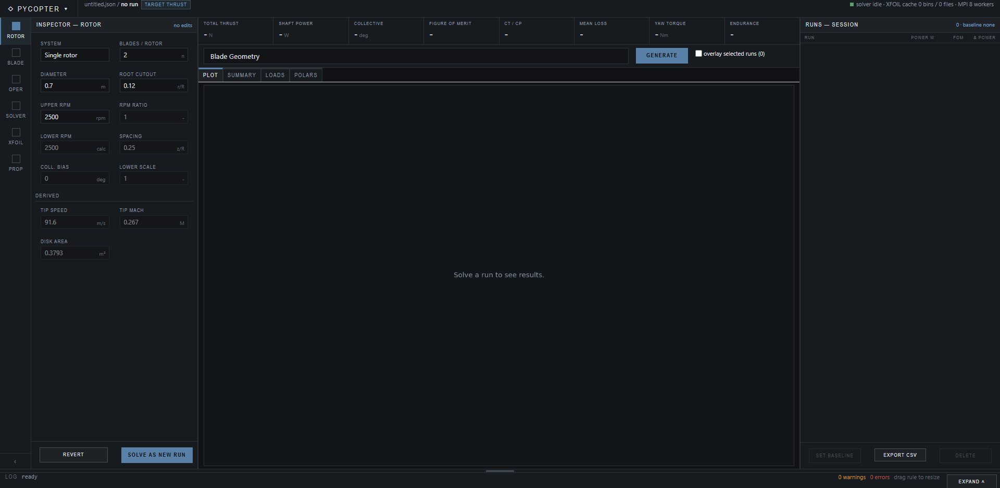

# PyCopter Tutorial

A guided walkthrough of the Web UI: what every input means, how to read the
outputs, and how to run a design study. If you only want to get the dashboard
open, see [Quick start](../README.md#quick-start) in the README.

- [1. The dashboard](#1-the-dashboard)
- [2. Defining a rotor](#2-defining-a-rotor)
- [3. Blade geometry](#3-blade-geometry)
- [4. Hover conditions](#4-hover-conditions)
- [5. Solver and XFOIL settings](#5-solver-and-xfoil-settings)
- [6. Reading the results](#6-reading-the-results)
- [7. Propulsion and endurance](#7-propulsion-and-endurance)
- [8. Coaxial rotors](#8-coaxial-rotors)
- [9. Design studies with the plots](#9-design-studies-with-the-plots)
- [10. Saving, loading, exporting](#10-saving-loading-exporting)
- [11. Worked example: sizing a 1 kg drone rotor](#11-worked-example-sizing-a-1-kg-drone-rotor)
- [12. Validating against real helicopters](#12-validating-against-real-helicopters)
- [Troubleshooting](#troubleshooting)

---

## 1. The dashboard

The window has four regions:

- **Toolbar** (top) — new/save/load configuration and the export buttons.
- **Rotor Parameters** (left column) — the rotor and its blade geometry.
- **Calculation Parameters and Propulsion Estimation** (middle column) — flight
  condition, solver settings, and the energy source.
- **Results** (right) — the plot picker, then the Plot, Summary, and Blade
  Element Loads tabs.
- **Run log** (bottom) — timestamped output from every action, including
  warnings.

Each column scrolls on its own, so opening a collapsible section never moves
anything else. The plot area grows to fill whatever space your monitor has.

---

## 2. Defining a rotor

| Input | Meaning |
|---|---|
| **Airfoil** | NACA 4/5/6-digit name (`naca0012`) or a UIUC database name, which is downloaded on demand. Used for every station unless a station overrides it. |
| **Rotor System** | *Single rotor* or *Coaxial*. |
| **Blades per Rotor** | Blades on **one** rotor, not the aircraft total. For coaxial, the same count applies to each rotor. |
| **Blade Chord [m]** | Uniform chord, used by the quick-entry geometry mode. |
| **Rotor Diameter [m]** | Disk diameter. |
| **Root Twist / Tip Twist [deg]** | Built-in twist at the first station and at the tip. The blade is linearly twisted between them in quick-entry mode. Twist is *added to* collective pitch, so a tip twist below the root twist is normal washout. |
| **Root Cutout r/R** | Fraction of the radius taken up by the hub, where no blade exists. That annulus produces no lift and is excluded. |
| **Upper / Ref RPM [rpm]** | Rotor speed. For coaxial, this is the upper (reference) rotor; the lower one follows the gear ratio in *Coaxial Settings*. |

Press **Initialize Rotor**. The log reports tip speed, tip Mach, disk area, and
solidity — a fast sanity check. Keep helicopter tip Mach roughly in the
0.55–0.65 band; small drone rotors typically run much lower.

> **Blades per rotor changed meaning.** Older PyCopter versions let you fake a
> multi-rotor aircraft by entering the total blade count. That is no longer
> right: use *Coaxial* for stacked rotors so the wake interaction is modeled.

---

## 3. Blade geometry

**Geometry Source** picks how the blade is described:

- **Uniform root/tip controls** — chord, root twist, and tip twist above define
  a linearly twisted, constant-chord blade.
- **Blade control point table** — the table is the source of truth, so you can
  taper the chord, use non-linear twist, and blend airfoils along the span.

Table columns:

| Column | Meaning |
|---|---|
| **r/R** | Station position, from root cutout to 1.0. Must ascend and be unique. |
| **Chord [m]** | Local chord. |
| **Twist [deg]** | Local built-in twist. |
| **Airfoil Override** | Leave blank to inherit the global airfoil; fill it to blend sections along the blade. |
| **Moment Axis [c]** | Chord fraction the pitching moment is taken about, typically `0.25`. This is a *moment reference*, not blade pitch. |

**Reset Geometry Points From Root/Tip Twist** refills the table from the
quick-entry fields — a convenient starting point before you edit it.

The solver interpolates these control points onto its own radial elements
(**Blade Elements**, default 60), so four well-placed rows are enough to define
a realistic blade.

---

## 4. Hover conditions

| Input | Meaning |
|---|---|
| **Gross Mass [kg]** | Total aircraft mass to be lifted. The solver trims collective until the rotor produces this weight in thrust. |
| **Density [kg/m3]** | Air density at the altitude of interest. Sea-level ISA is 1.225. |
| **Kinematic Viscosity [m2/s]** | Sets the local Reynolds numbers. Sea-level air is about 1.5e-5. |
| **Blade Elements** | Radial stations in the solve. 60 is a good default; more costs time and adds little. |
| **Search From / Search To [deg]** | Collective search bounds for the trim. |

Press **Calculate Hover**.

If the reported collective sits exactly on **Search To**, the solver hit its
bound rather than converging — the rotor could not lift the mass. Check total
thrust against the target before trusting anything else, then raise the bound,
enlarge the rotor, or lower the mass.

---

## 5. Solver and XFOIL settings

Collapsed by default; open them from the middle column.

**Background Solver Settings**

- **Tip Loss / Root Loss** — Prandtl loss models, or none. Prandtl is the
  sensible default; turning them off is a comparison aid.
- **Induced Factor** — empirical multiplier (about 1.05–1.15) covering
  non-uniform inflow that momentum theory misses.

**XFOIL Polar Generation**

- **Run XFOIL For Missing Polars** — when on, missing Reynolds/Mach bins are
  generated and cached. When off, only cached polars are used and XFOIL is never
  launched. Turn it off for fast repeat runs on a blade you have already solved.
- **XFOIL Alpha Min / Max [deg]** — angle-of-attack range of the generated
  tables. The maximum is capped at 18°, because XFOIL does not converge
  dependably past stall.
- **XFOIL Workers / Backend** — how many parallel XFOIL processes, and whether
  to distribute them over MPI. Choose *Serial debug* if you have no MPI runtime.
- **XFOIL Cache Dir** — optional custom cache path. Generated polars are scratch
  data and are never committed.

If any blade element asks for an angle of attack outside the loaded polar range,
the run log warns you, names the affected rotor, and reports the requested
range. Coefficients are clamped at the edge, so the result is optimistic in that
region — widen the alpha range and regenerate rather than ignoring it.

---

## 6. Reading the results

### Plot tab

Whatever you last generated. The figure is drawn at the size of your plot area,
so it stays legible on any monitor.

### Summary tab

Total thrust and shaft power, then per-rotor trim collective, torque, signed
aircraft yaw torque, figure of merit, `Ct`, `Cp`, solidity, root flap and lag
moments, per-blade pitching moment, and the active propulsion figures.

**Figure of merit** is hover efficiency: the ideal power to lift that thrust
divided by the actual shaft power. Well-designed helicopter rotors reach
0.70–0.80. Small, low-Reynolds drone rotors are often 0.40–0.60 — the numbers in
these screenshots are a 0.7 m drone rotor, so a figure of merit near 0.47 is
expected, not a bug.

**Aircraft yaw torque** is signed: positive is counterclockwise (left) yaw seen
from above, negative is clockwise. A single rotor always produces some, which a
tail rotor must counter; a torque-balanced coaxial pair drives it to zero.

### Blade Element Loads tab

One row per radial element: position, chord, twist, angle of attack, Reynolds,
Mach, section coefficients, loss factor, induced velocity, and the element's
thrust, torque, power, and pitching moment. The table scrolls horizontally
rather than hiding columns, and rows can be selected and copied.

This is where you diagnose a design. Angle of attack climbing toward the polar
limit near the tip means you are running out of stall margin; a collapsing
Reynolds number near the root means that part of the blade is doing little
useful work.

---

## 7. Propulsion and endurance

Choose the **Electric** or **Fossil fuel** tab. Only the active model appears in
outputs and plots, so the two never mix.

**Transmission Loss** is the mechanical loss between the power source and the
rotor shaft, applied in both models.

**Electric:** Battery [Wh], Usable Fraction (reserve — 0.8 is a common limit),
Motor Efficiency, ESC Efficiency. PyCopter reports electric input power and
hover endurance in minutes.

**Fossil fuel:** Fuel Capacity [kg] and Specific Fuel Consumption [kg/kWh].
PyCopter reports engine input power, fuel flow, and hover endurance in hours.

The rotor solve produces **shaft power only**. Everything above is applied
downstream, so changing the battery never changes the aerodynamics.

**Forward flight** (Velocity, Flat Plate Area) is a legacy low-order estimate
for single rotors, kept for range and endurance trends. It has no trim or
flapping model — see [Scope and limitations](../README.md#scope-and-limitations).
Flat plate area is the fuselage's equivalent drag area, either from published
data or as reference area × drag coefficient.

---

## 8. Coaxial rotors

Set **Rotor System** to *Coaxial* and open **Coaxial Settings**.

| Input | Meaning |
|---|---|
| **Coaxial Trim Objective** | *Torque-balanced hover* solves total thrust with zero net yaw torque — the realistic case. *Equal rotor thrust* and *Equal collective pitch* are comparison modes. |
| **Rotor Spacing z/R** | Vertical gap between disks over the upper rotor radius. |
| **Lower/Upper RPM Ratio** | Gear ratio; the resulting lower RPM is shown next to it. |
| **Lower Collective Bias [deg]** | Fixed collective offset applied to the lower rotor. |
| **Lower Geometry Scale** | Scales lower rotor diameter and chord if the two rotors differ. |

The lower rotor is solved inside the upper rotor's contracted wake, so it sees
faster inflow and needs more collective for the same thrust. The Summary tab
reports each rotor's thrust share, the interference power delta, and the
interference loss ratio.

Three coaxial-only plots become available: **Coaxial Interference** (isolated
versus coaxial power), **Interference Loss vs Spacing** (sweeps z/R and marks
the minimum), and **Coaxial Thrust Share and Yaw** (yaw authority from
differential collective).

---

## 9. Design studies with the plots

Pick from **Selected Plot** and press **Generate Plot**. Some plots read the
current result; the sweeps re-run the solver many times and take longer.

**Understanding the current design**

| Plot | Answers |
|---|---|
| Blade Geometry | Is the chord and twist distribution what I intended? |
| Power Breakdown | How much power is induced versus profile drag? |
| Radial Loads | Where along the blade is thrust and torque produced? |
| Alpha, Re, Mach vs Radius | What flow conditions does each station actually see? |
| Induced Velocity and Loss | How much do root and tip losses cost me? |
| Section Coefficients vs Radius | How is the airfoil behaving along the span? |
| Stall Margin vs Radius | How close is any station to the polar limit? |
| Cumulative Thrust and Power | Which part of the blade earns its keep? |
| Geometry Load Contribution | How does geometry map to load share? |
| Pitch Moment vs Radius | What drives the control-linkage hinge moment? |

**Sizing and trade studies** (these re-run the solver)

| Plot | Answers |
|---|---|
| Disk Loading Sensitivity | How do power and collective change with gross mass? |
| Rotor Diameter Sizing | What does a bigger rotor buy in power and endurance, and what does it cost in tip Mach? |
| Reference RPM Sweep | What is the best headspeed before compressibility bites? |
| Collective Authority Curve | How much thrust and yaw authority is left? |
| Payload Endurance Sweep | How does endurance fall off with payload? |
| Energy Capacity vs Endurance | What does a bigger battery or fuel load buy? |
| Efficiency and Loss Sensitivity | How sensitive is input power to efficiency assumptions? |

Sweeps skip points that fail to converge and say so in the log. A sweep that
skips many points usually means the collective search bounds are too tight for
part of the range.

---

## 10. Saving, loading, exporting

- **Save Config** downloads a JSON file with every input and the station table.
- **Load Config** restores one. Re-initialize the rotor afterwards. Legacy
  configs from the old desktop GUI are migrated automatically.
- **Save Plot / Save Summary / Save Loads** export the current figure as PNG and
  the two tables as CSV. If you have not generated the artifact yet, the log
  says so instead of downloading an empty file.
- **Clear Outputs** empties the run log.

---

## 11. Worked example: sizing a 1 kg drone rotor

The defaults are a 0.70 m, two-bladed `naca0012` rotor at 2500 rpm lifting 1 kg
on a 100 Wh battery.

1. **Initialize Rotor**, then **Calculate Hover**. Note the collective, shaft
   power, figure of merit, and hover endurance.
2. Generate **Alpha, Re, Mach vs Radius**. Check that no station is near the
   18° polar ceiling and see how low the root Reynolds number is.

   

3. Generate **Stall Margin vs Radius**. Any margin at or below zero means
   clamped coefficients and an optimistic answer there.
4. Generate **Rotor Diameter Sizing**. Endurance usually improves with diameter
   until tip Mach or airframe limits stop you — read both panels together.
5. Set the diameter to your best candidate, recalculate hover, and confirm the
   figure of merit and stall margin held up.
6. Generate **Payload Endurance Sweep** to see how much margin you have for a
   camera or a heavier battery.
7. **Save Config** so the design can be reloaded or shared.

The habit worth forming: after every geometry change, re-check the radial plots.
A change that improves total power while pushing the tip into stall is not an
improvement.

---

## 12. Validating against real helicopters

[`tutorials/presets/`](../tutorials/presets/) holds three configurations —
Mil Mi-8, MD 500E, and UH-60L (extended fuel) — with reference range plots
produced by the original desktop GUI.

Load one with **Load Config**, initialize, and calculate. These are full-size
helicopters, so expect much larger diameters, higher tip speeds, and higher
figures of merit than the drone defaults.

`tests/test_hover_real_world_cases.py` checks hover power for a Robinson R22 and
a UH-60 against published figures and runs as part of the suite.

> The preset files were saved by the legacy PyQt GUI, so they carry a `washout`
> field and an embedded output log. PyCopter migrates them on load; the log text
> is ignored.

---

## Troubleshooting

**"MPI XFOIL polar generation was requested, but mpi4py could not load an MPI
runtime."** Install [Microsoft MPI](https://learn.microsoft.com/en-us/message-passing-interface/microsoft-mpi),
or set **XFOIL Backend** to *Serial debug*.

**The first hover calculation is slow.** It is generating XFOIL polars for every
Reynolds/Mach bin the blade needs. They are cached, so later runs on the same
blade are much faster. Turn off *Run XFOIL For Missing Polars* to force
cache-only runs.

**Collective lands exactly on Search To.** The trim did not converge — the rotor
cannot lift the requested mass within the search bounds. Compare total thrust
against the target.

**"blade elements requested alpha outside the loaded polar range".** The blade
is asking for angles the polars do not cover. Widen XFOIL Alpha Min/Max, enable
*Run XFOIL For Missing Polars*, and recalculate. Results in that region are
clamped and optimistic until you do.

**An airfoil name is rejected.** NACA names must be `naca` plus 4, 5, or 6
digits. Other names are looked up in the UIUC database and need an internet
connection on first use.

**A sweep reports skipped points.** Those cases did not converge, usually
because the collective search bounds are too narrow across the swept range.
Widen Search From/To and try again.
